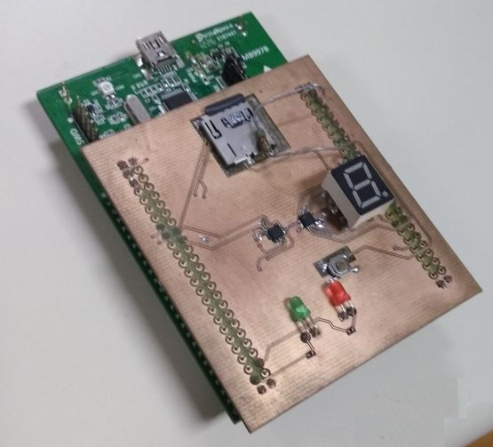
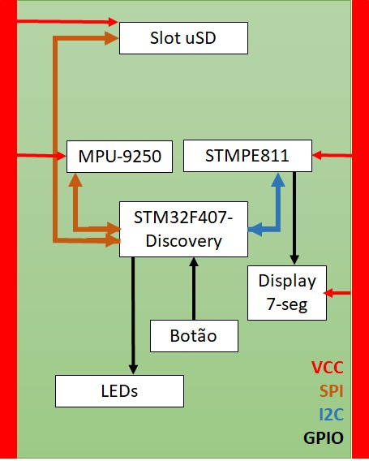

# Contador de passos com acelerômetro MPU-9250

### Conceito e Motivação
O objetivo do projeto é o desenvolvimento de um firmware para contar o número de passos dados por um usuário através do CI MPU-9250 da Invensense. O código deverá ser capaz de ler os valores dos acelerômetros do CI e com tais dados, calcular quantos dados a pessoa deu a partir de certo ponto. Tais passos poderão ser mostrados no display 7-segmentos da contido na placa.

Com esta aplicação, pode-se desenvolver um produto capaz de fornecer ao usuário informações relevantes em sua prática de exercício.

### Periféricos e Diagrama de Blocos

Para base de produção do fimrware será utilizada uma placa produzida pela RoboIME com suporte da IMBEL-FMCE e uma STM32F4Discovery produzida pela ST. A placa conta com, além do MPU-9250, um extensor de porta STMPE811, via I2C, conectado a um display de 7-segmentos, um botão, dois LEDs e um conector para cartão microSD.

Os periféricos mencionados se comunicam com o microcontrolador como ilustra o diagrama de blocos na imagem  abaixo.

## Referências

[MPU-9250 Datasheet][mpu]

[Cadência da corrida e como ela pode ajudar][globo-esporte]

[STM32F4Discovery][stm32f4]

[STMPE811 Datasheet][stmpe811]

[//]: # (These are reference links used in the body of this note and get stripped out when the markdown processor does its job. There is no need to format nicely because it shouldn't be seen. Thanks SO - http://stackoverflow.com/questions/4823468/store-comments-in-markdown-syntax)

   [mpu]: <https://www.invensense.com/products/motion-tracking/9-axis/mpu-9250/>
   [globo-esporte]: <http://globoesporte.globo.com/eu-atleta/saude/noticia/2016/03/voce-sabe-o-que-e-cadencia-da-corrida-e-como-ela-pode-ajudar.html>
   [stm32f4]: <http://www.st.com/en/evaluation-tools/stm32f4discovery.html#sw-tools-scroll>
   [stmpe811]: <https://br.mouser.com/datasheet/2/389/stmpe811-1309299.pdf>
   [markdown-it]: <https://github.com/markdown-it/markdown-it>
   [Ace Editor]: <http://ace.ajax.org>
   [node.js]: <http://nodejs.org>
   [Twitter Bootstrap]: <http://twitter.github.com/bootstrap/>
   [jQuery]: <http://jquery.com>
   [@tjholowaychuk]: <http://twitter.com/tjholowaychuk>
   [express]: <http://expressjs.com>
   [AngularJS]: <http://angularjs.org>
   [Gulp]: <http://gulpjs.com>

   [PlDb]: <https://github.com/joemccann/dillinger/tree/master/plugins/dropbox/README.md>
   [PlGh]: <https://github.com/joemccann/dillinger/tree/master/plugins/github/README.md>
   [PlGd]: <https://github.com/joemccann/dillinger/tree/master/plugins/googledrive/README.md>
   [PlOd]: <https://github.com/joemccann/dillinger/tree/master/plugins/onedrive/README.md>
   [PlMe]: <https://github.com/joemccann/dillinger/tree/master/plugins/medium/README.md>
   [PlGa]: <https://github.com/RahulHP/dillinger/blob/master/plugins/googleanalytics/README.md>
