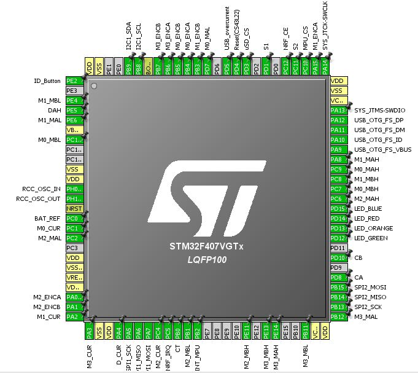
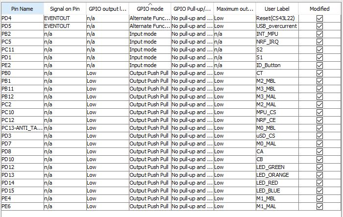

# Programa para Teste de Nova Placa Mãe para RoboIME SSL

### Conceito e Motivação
O objetivo do projeto é auxiliar a montagem das novas placas mãe da SSL (Small Size League). Com um firmware que teste todas as portas usadas pela placa, fica mais simples e rápido identificar bug e falhas tanto de projeto quanto de montagem.

Em relação às mudanças feitas em relação à placa anteiror, foi adicionado um MPU-9250, trocados os INA220s por INA169s, adicionado um expansor de porta via I2C STMPE811 para uso de um display 7-seg para mostrar o ID dos robôs e um slot para cartão SD.  

### Periféricos e Diagrama de Blocos

A placa, bem como os periféricos por ela utilizados estão mostrados abaixo no diaframa de blocos.

## Fluxograma do Firmware

O código segue o seguinte fluxograma:

Os pinos são declarados no início do código, bem como são setados os timers que serão usados nos PWMs e a interrupção por evento externo. 

Na main ocorre o teste dos periféricos via I2C e SPI, respectivamente, o expansor de portas e o MPU-9250 e NRF24L01P. Avaliando registradores que tem valores predefinidos pode-se checar se a comunicação está funcionando.

Para validação dos pinos foram usadas 6 funções que são responsáveis por alterar os valores dos pinos conforme eles serão utilizados normalmente. Os pinos de OUTPUT são levados para HIGH e para LOW, bem como os de INPUT (para debug, considerados OUTPUT). Para teste dos pinos com sinal PWM, ondas quadradas predefinidas são enviadas para esses pinos onde podem ser visualizadas com um osciloscópio. Há também a função para leitura dos pinos análogicos.

No display pode ser tanto mostrado um contador de tempo quanto o estado do Debug que a pessoa está, visto que quando a interrupção do botão é acionada, é incrementado uma unidade no valor do display, até que chegue no máximo e resete. 

## Pinagem

Para o projeto o MXCube da ST foi utilizado para auxiliar na escolha das pinagens, mesmo a programação sendo feita com a biblioteca Standard Peripheral. Abaixo estão os pinos utilizados pela placa discovery juntamente com os escolhidos para o projeto SSL.

Destes pinos, os seguintes são pinos GPIOs de input/output: 

Quanto aos pinos de SPI, foram usados 2 spis, por causa da diferença de frequência necessária para cada periférico. Para o NRF, foi usado o SPI1, com pinos PA5 a PA7, com uma frequência de cerca de 5MHz de frequencia e o SPI2, para o MPU9250 e o cartão SD, com frequência de 65KHz e pinagem PB13 a PB15. Os pinos I2C usados foram PB8 e PB9. 

Os sinais PWM usados são os Mx_MAH e Mx_MBH, usando os Timers 8 e 1, com os pinos Mx_ENCA e Mx_ENCB, usando os timers 2 a 5. Os pinos analógicos servem para leitura de corrente dos motores, Mx_Cur e VBATREF.

## Funções

Estas são as funções principais dos códigos, que executam o teste de Set e Reset de sinais logicos, envio de sinal PWM e escrevem no display tanto o estado do teste (em qual estado está) ou mostra uma contagem de tempo.

void testLEDs();
void testGPIOsON();
void testGPIOsOFF();
void testPWM();
void testGPIOsINOn();
void testGPIOsINOff();
void testGPIOsANA();
void ShowCountDownDisplay();
int ShowNumber(int number);

## Vídeo demonstrativo

## Auxílio

Capitão Renault e a IMBEL FMCE pelo auxílio na montagem da placa

Colegas de turma

## Referências

[MPU-9250 Datasheet][mpu]

[STM32F4Discovery][stm32f4]

[STMPE811 Datasheet][stmpe811]

[//]: # (These are reference links used in the body of this note and get stripped out when the markdown processor does its job. There is no need to format nicely because it shouldn't be seen. Thanks SO - http://stackoverflow.com/questions/4823468/store-comments-in-markdown-syntax)

   [mpu]: <https://www.invensense.com/products/motion-tracking/9-axis/mpu-9250/>
  
   [stm32f4]: <http://www.st.com/en/evaluation-tools/stm32f4discovery.html#sw-tools-scroll>
   [stmpe811]: <https://br.mouser.com/datasheet/2/389/stmpe811-1309299.pdf>
   [markdown-it]: <https://github.com/markdown-it/markdown-it>
   [Ace Editor]: <http://ace.ajax.org>
   [node.js]: <http://nodejs.org>
   [Twitter Bootstrap]: <http://twitter.github.com/bootstrap/>
   [jQuery]: <http://jquery.com>
   [@tjholowaychuk]: <http://twitter.com/tjholowaychuk>
   [express]: <http://expressjs.com>
   [AngularJS]: <http://angularjs.org>
   [Gulp]: <http://gulpjs.com>

   [PlDb]: <https://github.com/joemccann/dillinger/tree/master/plugins/dropbox/README.md>
   [PlGh]: <https://github.com/joemccann/dillinger/tree/master/plugins/github/README.md>
   [PlGd]: <https://github.com/joemccann/dillinger/tree/master/plugins/googledrive/README.md>
   [PlOd]: <https://github.com/joemccann/dillinger/tree/master/plugins/onedrive/README.md>
   [PlMe]: <https://github.com/joemccann/dillinger/tree/master/plugins/medium/README.md>
   [PlGa]: <https://github.com/RahulHP/dillinger/blob/master/plugins/googleanalytics/README.md>
